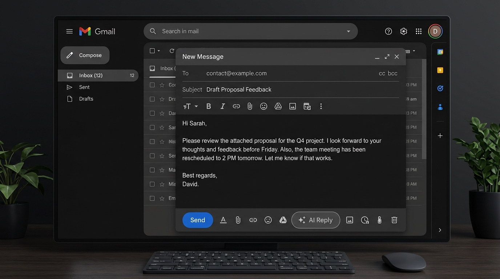
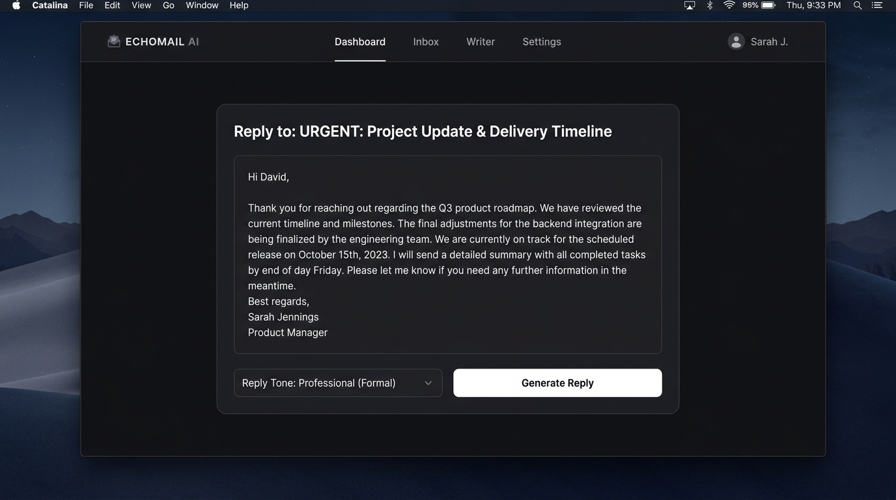

# Smart Email Assistant 🚀

An AI-powered Smart Email Assistant that generates intelligent, context-aware email replies directly inside Gmail.

## 🔗 Live Frontend Preview

* Frontend Application: [https://smartmail-ai-app.vercel.app/](https://smartmail-ai-app.vercel.app/)
* Backend API: [https://smart-email-assistant-tc1m.onrender.com/](https://smart-email-assistant-tc1m.onrender.com/)

Built using Spring Boot, React, Google's Gemini API, and a Chrome Extension.

## 🌟 Features

* Generate AI-powered email replies instantly
* Multiple tone options: Professional, Casual, Friendly
* Seamless Gmail integration via Chrome Extension
* One-click reply insertion into Gmail compose window
* Copy generated replies to clipboard
* Responsive and modern user interface

## 🛠️ Tech Stack

### Frontend

* React.js
* Material UI
* Axios
* JavaScript
* CSS

### Backend

* Java
* Spring Boot
* Spring WebFlux (WebClient)
* Maven

### AI Integration

* Google Gemini API

### Browser Extension

* Chrome Extension APIs
* JavaScript
* HTML
* CSS

## 🏗️ Architecture

1. User opens an email in Gmail.
2. Chrome Extension injects an **AI Reply** button.
3. On click, the email content is extracted.
4. Content is sent to the Spring Boot backend.
5. Backend calls the Gemini API.
6. AI-generated reply is returned.
7. Reply is automatically inserted into Gmail compose box.

## 📂 Project Structure

```text
Smart-Email-Assistant/
├── Email-Writer-Ext/          # Chrome Extension
├── email-writer-fronted/      # React Frontend
├── email-writer-sb/           # Spring Boot Backend
└── README.md
```

## 🚀 Getting Started

### Prerequisites

* Java 17+
* Node.js 18+
* Maven
* Google Chrome
* Gemini API Key

### Backend Setup

```bash
cd email-writer-sb/email-writer-sb
./mvnw spring-boot:run
```

### Frontend Setup

```bash
cd email-writer-fronted
npm install
npm run dev
```

### Chrome Extension Setup

1. Open Chrome and navigate to `chrome://extensions/`
2. Enable **Developer Mode**
3. Click **Load unpacked**
4. Select the `Email-Writer-Ext` folder

## 🔐 Environment Configuration

Add your Gemini API key in `application.properties`:

```properties
gemini.api.url=YOUR_GEMINI_API_URL
gemini.api.key=YOUR_GEMINI_API_KEY
```

## 📸 Screenshots

### Gmail Extension Integration


### Playground UI Dashboard



## 🎯 Use Cases

* Professional email drafting
* Quick response generation
* Customer support replies
* Business communication automation

## 🔮 Future Enhancements

* Multi-language support
* Custom tone creation
* Email summarization
* Attachment-aware replies
* Support for Outlook and other email platforms

## 👨‍💻 Author

**Kanhaiya Kumar**

* GitHub: [https://github.com/kanhaiyamishra05](https://github.com/kanhaiyamishra05)
* LinkedIn: https://www.linkedin.com/in/kanhaiya-kumar5/

## 📄 License

This project is licensed under the MIT License.

---

If you found this project useful, consider giving it a ⭐ on GitHub!
